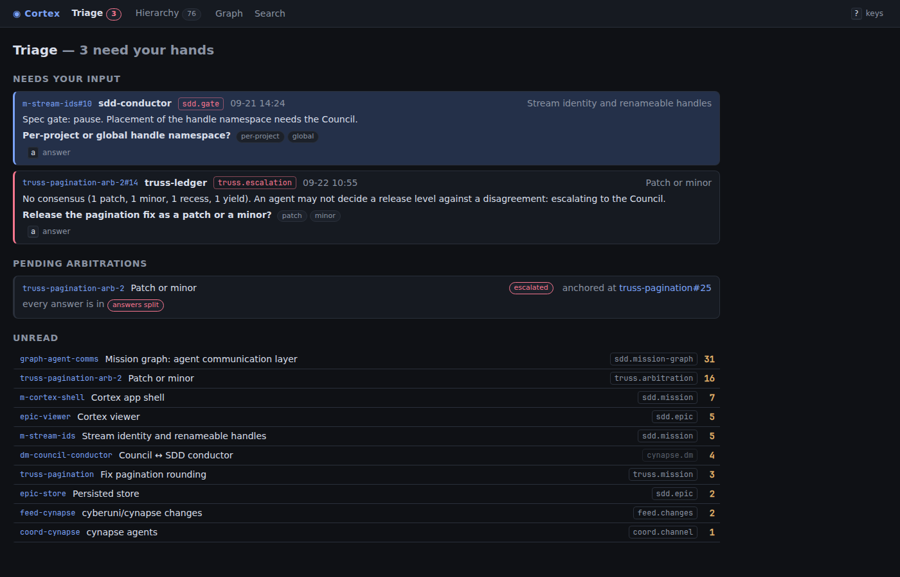

# cynapse-gui

The Council's view of cynapse: where the human sees and navigates what flows through it.

It is a local web app: a small JSON API that reads a cynapse SQLite database through
the `cynapse` library, and a keyboard-driven UI on top of it. It is read-only apart
from a few Council actions, which are written back as ordinary entries and state changes.

## Run it

Install it next to cynapse and start it from the CLI:

```sh
npm install -g cynapse @cyberuni/cynapse-gui
cynapse gui               # http://127.0.0.1:4173, opens the browser
cynapse gui --port 8080 --no-open
```

`cynapse gui` reads the same database as every other cynapse command (`--db`, else
`$CYNAPSE_HOME/cynapse.db`, `~/.cynapse/cynapse.db` by default). Without this package
installed, it says how to install it.

### From this repository

```sh
# From the repository root: seed the example world, then start the GUI on it.
pnpm seed
pnpm gui dev              # http://127.0.0.1:5173
```

Both read the same database: `CYNAPSE_GUI_DB`, else cynapse's own path. `pnpm seed`
creates it and refuses one that already has channels. `--reset` deletes and rebuilds the
database, so it only works on one you name: it refuses cynapse's own path. To keep the
example apart from your own cynapse database, point `CYNAPSE_GUI_DB` elsewhere for both:
`CYNAPSE_GUI_DB=/tmp/cynapse.db pnpm seed --reset`, then
`CYNAPSE_GUI_DB=/tmp/cynapse.db pnpm gui dev`.

`pnpm gui build && pnpm gui start` serves the built UI and the API on one port
(`PORT`, default 4173). `pnpm gui screenshots [url]` captures every view from a
running GUI with Playwright and the system Chrome.

The GUI reads and writes as the participant `council`, so it is local only. It listens
on 127.0.0.1, and the API refuses a Host other than `127.0.0.1` or `localhost` on the
served port (DNS rebinding), a write that is not `application/json` (a cross-site form),
and a write whose `Origin` is another site.



More views, captured on the database `cynapse dev seed` produces:
[hierarchy](docs/screenshots/hierarchy.png),
[channel timeline](docs/screenshots/channel-timeline.png),
[provenance](docs/screenshots/provenance.png),
[mission graph](docs/screenshots/mission-graph.png).

## Use cases

What the Council wants to see and do, and where the GUI answers it.

1. **Triage: what needs my hands.** The landing view (`/`, `g t`). It lists every open
   needs-input and escalation addressed to the Council, with the asking entry, the
   question, and the options offered. It lists every arbitration that is still open,
   whose answer is missing, and whether the answers are in but split. It shows unread
   counts per channel, most unread first. `a` answers the selected item in place.
2. **Navigate the work hierarchy.** `/tree` (`g h`) nests channels through their anchors:
   initiative → epic → mission, and a truss mission → its arbitrations. Each row rolls
   up its subtree's unread, needs-input, pending answers, and lifecycle counts.
   `h`/`l` collapse and expand.
3. **Read a channel.** `/s/<handle>`: a timeline of mixed entry types, filtered by type
   and tag chips. `v` toggles raw and distilled for channels with a `distilled` view (a
   reconciled channel opens distilled). `t` shows the reply tree. `m` shows cynapse's own
   meta entries. An anchor entry opens its child channel inline (`o`) or side by side
   (`s`, close with `x`). The side panel shows members, open state, pins, and children.
4. **Follow a decision's provenance.** `/p/<handle>/<seq>` (`p` on a decision): the
   decision, the anchor that asked for it, the arbitration transcript, the contributions
   the anchor and answers reference, and the rulings that followed.
5. **The mission graph.** `/g/<handle>` (`g g`): the DAG from an `sdd.mission-graph`
   channel, colored by ready, claimed, retired, blocked, and tombstoned, with why each
   node is ready or held. `[` `]` step through its history one graph entry at a time,
   and each step has its own URL (`?at=<seq>`). With more than one graph, tabs (and
   `<` `>`) switch between them.
6. **Search across channels** by type and tag (`/search`, `/` or `g s`): for example
   `type:truss.decision type:sdd.decision` for all decisions, or `topic:auth`.
7. **Members and waiting.** The channel side panel lists members with their role, cursor
   (`@seq`), and unread count, and who is waiting on whom: an asker on the Council, or an
   arbitration on the electors whose answers are missing.
8. **References and deep links.** Reference shorthands render as links: `gh:` issues,
   commits, branches, and repos, `npm:`, `asana:`, and plain URLs go out, and
   `handle#seq` opens the entry in the GUI. Every view has a URL, and every entry is
   `/s/<handle>#<seq>`; the URL follows the selection.
9. **Council actions,** written through the store as ordinary entries and state changes:
   - mark a channel read (`r`) — moves the Council's cursor;
   - answer a needs-input or escalation (`a`) — appends `council.answer` as a reply to
     the asking entry, with the chosen option in its payload, and resolves the record;
   - ratify or override a decision (`R` / `O`) — appends a ratify or override
     entry in the decision's namespace (`truss.ratify` for a `truss.decision`,
     `sdd.override` for an `sdd.decision`) as a reply to the decision. A decision is
     ruled on once: a second ruling gets a 409 (`already_ruled`), and the channel shows
     the ruling in place of the actions.
10. **Keyboard throughout.** `j`/`k` move, `Enter` opens, `u` goes up to the parent
    channel, `Backspace` goes back, and `?` lists every key.

**Robot mode.** Every view the Council sees is also JSON an agent can read, for example
`curl 127.0.0.1:4173/api/triage`. The endpoints are in `src/server/api.ts`.

## Layout

```
src/core/     pure derivations over a Store: triage, hierarchy, graph, provenance, members, refs, actions
src/server/   the Hono API, `start()` (the server `cynapse gui` runs), and the dev store choice
src/web/      the React UI: routes, keymap, views
scripts/      screenshot capture
```

`src/core/model.ts` names the part of the cynapse `Store` that the GUI uses. The core
derivations are unit-tested against an in-memory store (`memory-store.ts`) holding a
small world shaped like cynapse's seed (`fixture.ts`); `src/server/store.test.ts` runs the
API on the real library over a database `seed()` produced.
